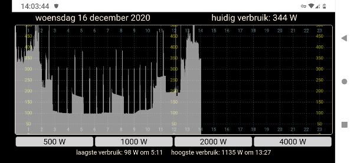

# smartMeterLogger-esp32

## About

`smartMeterLogger-esp32` connects to a smart meter (slimme meter) and logs the electricity use per minute  to an sdcard. Saved data can be viewed in a html5 compatible browser. (phone/laptop/desktop)

## How to use

1. Change your credentials in `wifisetup.h`.
1. (Optional) In `smartMeterLogger-esp32.ino` uncomment `#define SH1106_OLED` if you compile for sh1106 instead of ssd1306 and set the i2c pins (and address) for your oled screen.
3. Save all files and flash the sketch to your esp32.
4. Connect your esp32 to the smart meter. [See here how](https://github.com/matthijskooijman/arduino-dsmr#connecting-the-p1-port). Take note that to connect to the esp32 the `DATA` signal has to be inverted and level shifted.
5. If you added a ssd1306/sh1106 oled screen, the ip address will be visible on the screen. If there is no oled you can check the ip address on the serial port in the Arduino IDE.
6. Browse to the ip address of your esp32 to see your current energy use.

If you have a garbled screen you most likely compiled for the wrong oled type. Try to comment/uncomment `#define SH1106_OLED` to solve this.

## Needed libraries

- [https://github.com/me-no-dev/AsyncTCP](https://github.com/me-no-dev/AsyncTCP)
- [https://github.com/me-no-dev/ESPAsyncWebServer](https://github.com/me-no-dev/ESPAsyncWebServer)
- [https://github.com/matthijskooijman/arduino-dsmr](https://github.com/matthijskooijman/arduino-dsmr)

Download and install these in the Arduino libraries folder.

The driver library for a ssd1306/sh1106 oled can be installed with the Arduino library manager. Use the ThingPulse driver.

## DSMR v5 P1 port standard specifications

[DSMR v5.0.2 P1 Companion Standard.pdf](https://github.com/matthijskooijman/arduino-dsmr/blob/master/specs/DSMR%20v5.0.2%20P1%20Companion%20Standard.pdf)

## Hardware

### ESP32: LilyGo TTGO T7 with external antenna

My personal preference is for the LilyGo TTGO T7. The LilyGo TTGO T7 is a good board with an external antenna connector and a decent 3.3v LDO. Without an external antenna the WiFi signal tends to be too poor to be of any use over longer distances and/or through several walls. The board will have to modified slightly to enable the external antenna.

Below you can see how to enable the external antenna. Move the zero ohm resistor from position 1-2 to position 3-4. Or remove the resistor and solder position 3-4 closed.

See [this LilyGo issue](https://github.com/LilyGO/ESP32-MINI-32-V1.3/issues/4#issuecomment-610394847) about the external antenna.

### SD card reader

Using the default pins.

### Level shifter / inverter

To invert and level shift the signal you can use a bc547 transistor with some resistors. For example like this:

See [willem.aandewiel.nl/dsmr-logger-v4-slimme-meter-uitlezer/](https://willem.aandewiel.nl/index.php/2019/04/09/dsmr-logger-v4-slimme-meter-uitlezer/)

### Some board variants

